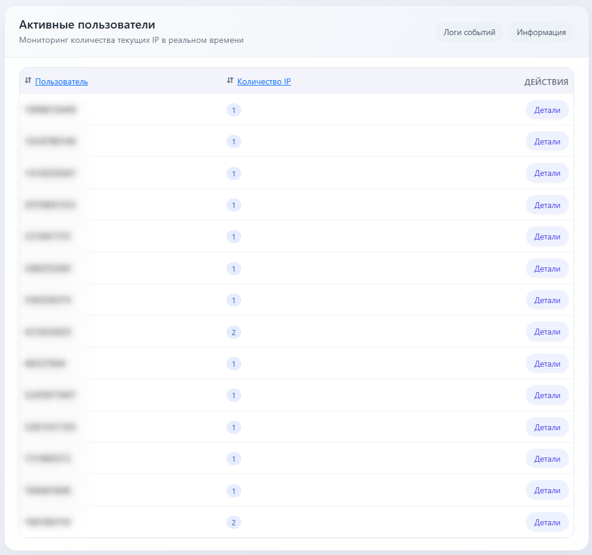
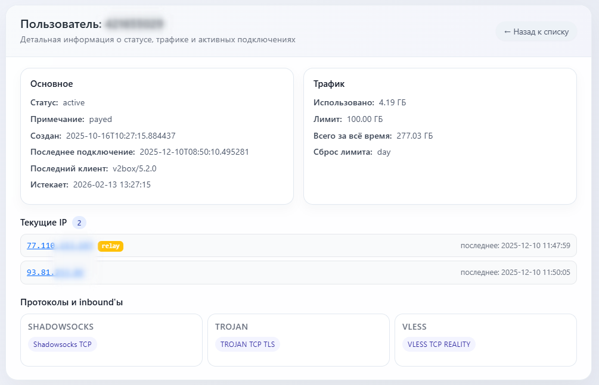

# Marzban IP Limiter
Это инструмент, который в реальном времени отслеживает количество ip-адресов под одним аккаунтом. И позволяет блокировать пользователя на некоторое время (5 минут) при превышении допустимого количества.  
*Т.к. в marzban нет встроенного ограничения по количеству одновременных подключений.*  
**Только для linux.**

Sorry, russian only.

## Скриншоты
    

## Возможности
* Поддержка последней версии Marzban
* Поддержка Core (основной сервер marzban) и нод (marzban-node)
* Работает с API (авторизуется, обновляет токен)
* Получает список нод, информацию о пользователях и т.д.
* Читает логи через websocket
* Ведет журнал действий (sqlite)
* Гибкая настройка в конфиг файле
* Возможность задать индивидуальные лимиты для аккаунтов
* WebUI с использованием bootstrap 5.3 (по умолчанию порт 8080)
* Просмотр информации об аккаунте (в т.ч. текущие ip-адреса)
* Просмотр конфигурации и информации о подключенных нодах
* Просмотр журнала срабатываний
* Возможность запуска как сервис (systemd)
* Возможность сортировки по аккаунтам и по кол-ву ip-адресов
* Возможность редактирования шаблонов для WebUI (в т.ч. внедрять свои javascript)

## Установка
* Скопировать на сервер. (желательно разместить на сервере с вэб-панелью marzban)
* Настроить конфиг
* Разрешить API у Marzban
* Внести изменение в конфигурацию marzban (логирование)
* Создать пользователя с sudo для инструмента (желательно)
* Установить curl (если его нет)
* Запустить

## Покупка
:basket: [Купить](https://support.chudik.pro/index.php?a=add&catid=6) через форму обратной связи.  
Покупка единоразовая навсегда, независимо от количества нод.  
Поставляется в виде бинарника.  
Лицензия привязана к серверу, на котором и будет запускаться программа.  
Поддержка в Telegram (включая обновления)

## Безопасность
В этом инструменте нет управления, только просмотр.  
Но все же, лучше не показывать всем эти данные. Я не делал встроенную авторизацию.  
Поэтому, вы можете ограничить к web доступ:
* Через вэб-сервер в режиме reverse proxy (nginx, apache, etc..)
* Разрешить доступ только со своего ip-адреса (фаерволлом)

**Не создает внешних запросов** (можете проверить любым сетевым инструментом)  
Работает только локально и только с вашими серверами, указанными в конфигурации.